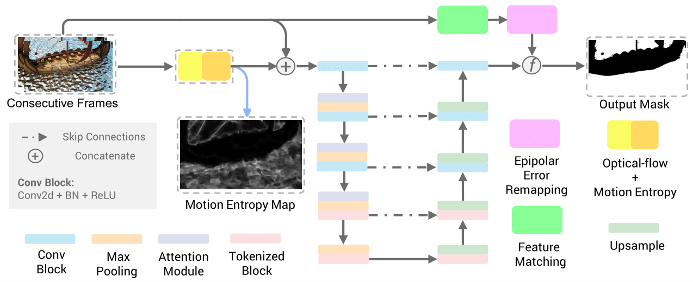

# MARVIS: Motion & Geometry Aware Real and Virtual Image Segmentation
The official implementation of "MARVIS: Motion &amp; Geometry Aware Real and Virtual Image Segmentation"
[[Preprint](https://arxiv.org/abs/2403.09850)]

